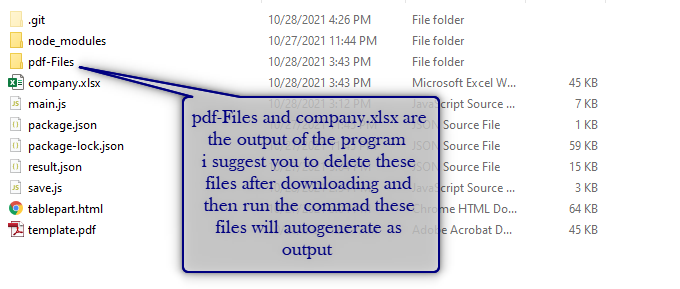
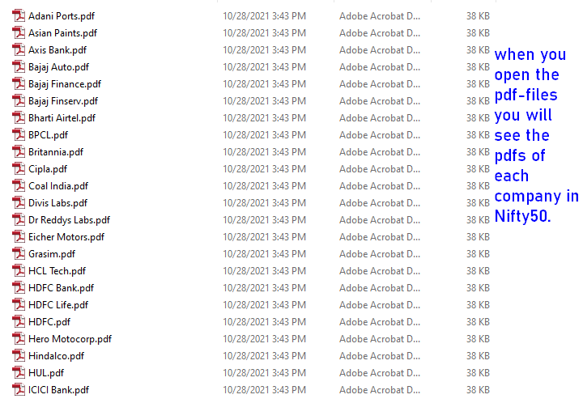

# Stock-Values-of-NIFTY50-webscrappingData

This project scraps the data from the moneycontrol.com makes the folder of each company under NIFTY-50 and returns values like company stock price on a perticular day in excel and pdf format.


## npm Modules used are:- 
- cheerio
- postman-request
- pdf-lib
- excel4node

```
$ npm i cheerio
$ npm i postman-request
$ npm i pdf-lib
$ npm i excel4node
```
When you install all the npm modules I suggest you that please delete the company.xlsx and pdf-Files folder as it is the output of the program.

after you delete these two files than run the program by :
```
node main.js
```

If you want to see the data perticular data scrapped please [visit](https://www.moneycontrol.com/markets/indian-indices/) . 

## Futher down I am sharing the output you are expected to see.

### Folder output

### excel output

### pdf folder

### pdf output


## Vedio Representation

[](MNscraper.mp4)


hope you like the project.:heart::heart::heart: 

## peace to everyone :pray:
